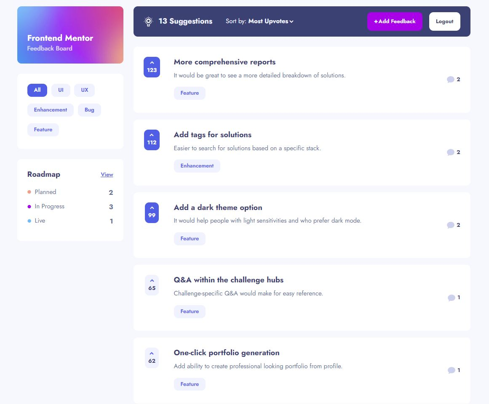
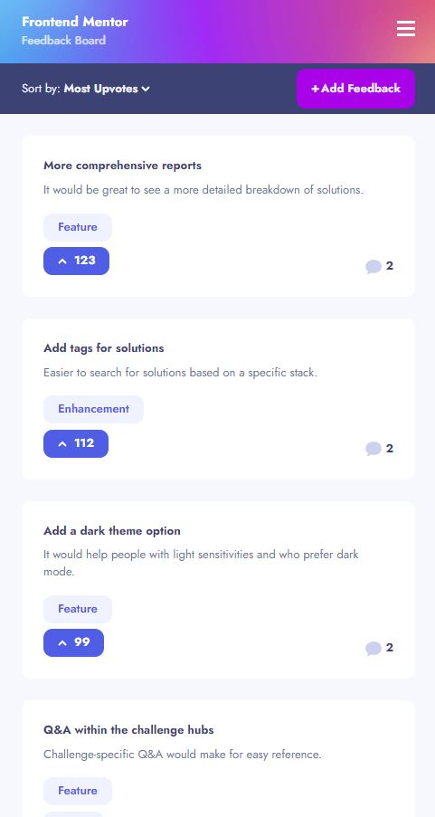

# Product Feedback App - [LIVE DEMO](yeong-product-feedback.netlify.app)

## Table of contents

- [Overview](#overview)
  - [The challenge](#the-challenge)
  - [Screenshot](#screenshot)
  - [Links](#links)
- [My process](#my-process)
  - [What I learned](#what-i-learned)
  - [Continued development](#continued-development)
  - [Built with](#built-with)
  - [Useful resources](#useful-resources)
- [Author](#author)

## Overview

### The challenge

Users should be able to:

- View the optimal layout for the app depending on their device's screen size
- See hover states for all interactive elements on the page
- Create, read, update, and delete product feedback requests
- Receive form validations when trying to create/edit feedback requests
- Sort suggestions by most/least upvotes and most/least comments
- Filter suggestions by category
- Add comments and replies to a product feedback request
- Upvote product feedback requests
- Login and logout
- Use external databases for persistent data

### Screenshot




### Links

- Github URL: (github.com/YeongOh/product-feedback-app/)
- Live Site URL: (yeong-product-feedback.netlify.app)

## My process

### What I learned

As I build this project, I have faced more difficulties than I anticipated.
The following sections discuss each problem by order of incidence.

#### Making components too early

In the early development stage, I was having the mind of "I am going to do the perfect job of diving a big piece into separte components and make them reusable throughout the project!". It actually ended up with a lot of reverting back and spending more time fixing. For example, HTML element "Input" does not need to be a separate UI component. All I have to do to give the same look throughout the project is just declare its CSS properties in index.css. Another example is making the component too early. I made a "LinkButton" that looks like a button but it is actually a React Router Link element. Since I made this component too early in the stage, I had to keep going back to the component and add more props, which eventually wasted my time more.

#### Form Dropdown Menu

Form dropdown menu can be easily made with html elements "select" and "options", but there is a caveat. Option dropdowns will look different in some OS or browsers because select has its own native look that CSS cannot change. Therefore, to give the same apperance across all users, I made a div container and buttons to choose options from. I chose button for accessibilty as a user can tab through them. It is a simple dropdown menu and I could've spent less time on it, but diving a little deeper required me more time to implement it.

#### SVG Files

To change the color and some css properties of SVG icons, you have to install SVGR plugins and call them as react components into the project.

#### Sliding Sidebar

Sliding sidebar works similar to a horizontal image scroller. You hide sidebar outside of the screen by giving css property "right: sidebar.width" then giving "transform: translateX(sidebar.width)". It seems pretty straightforward, but I have seen poor implementations all the time as I browse through the web. Sometimes you are able to scroll even after the sidebar appears. If you disable the scrollbar when the sidebar appears, the screen expands by scrollbar's width, pulling and pushing the screen. These little things can annoy sensitive users like myself and can give the impression that the website is not a production-ready. To fix these, the following css was used.

```css
html {
  scrollbar-gutter: stable;
}

// you activate this class as you click sidebar menu
body.overflow-hidden {
  overflow-y: hidden;
  height: 100%;
}
```

#### Comments of Feedbacks Not An Array

The mock data file had {...feedback, comments: [{comment1, comment2, ...}]} as a default structure. However, when inserting a new comment, they were not saved as an array, but just an object of objects like this: comments: {comment1, comment2, ...}. To work around this issue, when I load a feedback, I check if comments exists or not. If they exist, I will check if they are array, if they are array, just return. If they are not, I will use Object.values({comments}) to return the new array. This probably will not scale very well with a thousands of comments, but it will suffice in the scope of this project.

#### No Timestamp of Feedbacks of Comments

I could think this as convenience because I get to implement less for the project requirement, but it was not. Firebase sorts objects by their key. If I use uuid as key, the order of feedbacks would not be time of their creation. To address this issue, I discovered that there is a handy method "push" in firebase that finds the reference to the last child of objects in the list. Using this method and its key value to look the data up, I could fix it. It took me at least an hour to figure out.

#### Feedback's id as the number of feedbacks?

The project's requirement stated that if I go to 'feedbacks/10', it has to show 10th feedback and id should always be the number of feedbacks. However, what will happen if there is a 10th feedback and I delete the 9th one? When I make the new feedback, it will override 10th feedback, to fix this, I have to add in 3 additional steps.

1. get the number of feedbacks from firebase
2. check if there is a feedback at `feedbacks/${numOfFeedbacks + 1}`
3. if not, write a new feedback
4. if there already is a feedback, find an empty spot to write

I figured this is an unncessary requirement and brings in more trouble than conveniences, so I did not implement this way except the first 10 feedbacks in the mock data.

#### sort() on undefined values

Sort by "most comments" or "least comments" will sort feedbacks and some feedbacks without comments will give undefined errors. Such error can be fixed by simply using optional chaning.

```js
[...feedbacks].sort((a, b) => b.comments?.length - a.comments?.length);
```

However, the problem arises when you try to sort feedbacks by undefined values in the middle. I solved this problem by simply checking if the comments exists and return -1 if it does not exist.

```js
[...feedbacks].sort((a, b) => {
  if (!b.comments) return -1;
  return b.comments?.length - a.comments?.length;
});
```

#### Sphagetti Codes, Components, Optimization, Refactoring

During the development, I found myself writing sphagetti codes. I could have separated more components out. However, I really wanted to finish the project as soon as possible, and then go on refactor and optimize. Even though I was doing my best to get the code working early, it still took me more time than I expected. I should not do this type of development in a team project where multiple people are touching the same codebase.

### Continued development

#### React Query

I'd like to improve on more elegant state management than useState. I have tried React Router loader for the first time, but as it does not provide caching, I will use React Query and incorporate loader whenever I need to prefetch.

#### Time management

In the early stage of the porject, I was so caught up on doing everything perfect. Pixel perfect css, perfect implementation, perfect html and accessibility. This definitely delayed my development on this project. Also, I burn out as well in that process as I was progressing very slow. I should have done this project roughly first, then revisit. After I got exhausted, I really tried to implement at least one feature everyday no matter how small that is. That really helped me to not lose my track and finish the project.

### Built with

- Semantic HTML5 markup
- CSS Modules
- Flexbox
- Mobile-first workflow
- [React](https://reactjs.org/)
- React Router
- Vite
- Firebase

### Useful resources

- [Javascript.info](https://javascript.info) - It helped me graps fundamentals of objects and arrays whenever I got confused while doing this project.

## Author

- Frontend Mentor - [@YeongOh](https://www.frontendmentor.io/profile/YeongOh)
